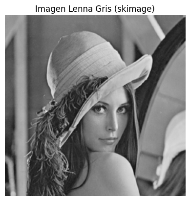
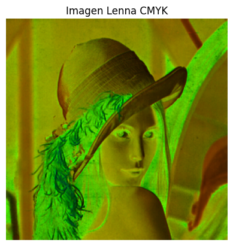
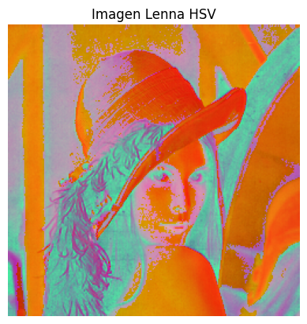
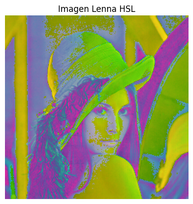
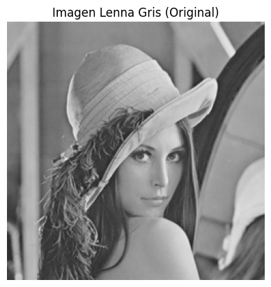
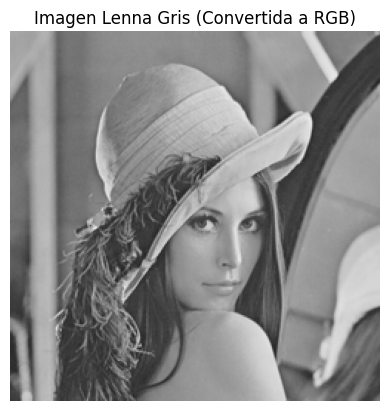

# Procesamiento de Imágenes
Luciano Masuelli  
Facundo Gaviola  
## Trabajo Práctico N°1
### 1. Modos de color en imágenes
### Ejercicio 6  
**La conversion de una imagen de color a escala de grises se puede hacer de varias formas. El ejercicio consiste en convertir la imagen de Lenna color a escala de grises utilizando diferentes metodos.** 

**(a) Usando la libreria cv2 y el metodo `cvtColor()`**  

```py
lenna_gris = cv2.cvtColor(lenna_color, cv2.COLOR_BGR2GRAY) # Solo queda una tupla con las dimensiones de la imagen. No hay canales
show_image(lenna_gris, 'Imagen Lenna Gris')
```


**(b) Usando la formula de luminancia**  

```py
#Formula de luminancia: Y = 0.299*R + 0.587*G + 0.114*B. Esta formula se desprende de como el ojo humano percibe los colores. 
b, g, r = cv2.split(lenna_color)
lenna_gris = 0.299 * r + 0.587 * g + 0.114 * b
lenna_gris = lenna_gris.astype(np.uint8) # el resultado de la operacion anterior deevuelve float, openCV no puede
# trabajar con float sino valores en el rango 0-255.
show_image( lenna_gris, 'Imagen Lenna Gris (Luminancia)')
```


**(c) Usando scickit-image y el metodo `rgb2gray()`**  

```py
lenna_color_rgb = cv2.cvtColor(lenna_color, cv2.COLOR_BGR2RGB)  # Convertimos a RGB
lenna_gris = ski.color.rgb2gray(lenna_color_rgb)  # Convertimos a escala de grises
lenna_gris = (lenna_gris * 255).astype(np.uint8)
show_image(lenna_gris, 'Imagen Lenna Gris (skimage)')
```


Se pueden ejecutar los ejercicios en el siguiente [Notebook](./TP1/ej1.ipynb#6). En la sección que corresponde al ejercicio 6 se encuentra la función `ej6()` que contiene el código anterior.  

**(d) ¿Que pasa con los canales?**  
Al transformar la imagen a una escala de grises, perdemos los distintos canales de colores de la imagen quedando un solo canal con los valores de [0-255] donde, 0 = negro, 255 = blanco [1-254] = grises. Esto es basicamente lo que hace la formula de luminancia.  

**(e) ¿Que profundidad de bits tiene la imagen?**  
La profundidad de bits se ve alterada ya que cuando teniamos la imagen a color poseiamos 3 canales con 256 valores para cada uno, dando como resultado una profundidad de 24 bits (256 x 256 x 256 = 2^8 x 2^8 x 2^8). Al reducir la imagen a un solo canal al transformarla a una escala de grises la imagen va a poseer 8 bits de profundiad (256 = 2^8).

**(f) Evaluar con otra imagen de mayor profundidad** 

**(g) ¿Que sucede con la imagen? ¿Ha cambiado algo?**  
De manera similar a como ocurre con una imagen de profundidad de 24 bits a color, si transformamos una imagen cuya profundidad es mayor, como por ejemplo 36 (4096 x 4096 x 4096 = 2^12 x 2^12 x 2^12), a una escala de grises quedaria una imagen de una profundidad de 12 (4096 = 2^12).  

### Ejercicio 7
**Convertir la imagen de Lenna a otros modos de color, como CMYK, HSV, HSL. Mostrar el resultado.**  

Al realizar la conversión a CMYK se utiliza el método `split()` de la librería cv2 para obtener los valores R,G y B. Luego se normalizan y se calcula el valor de K como la diferencia entre 1 y el máximo valor de R, G o B. Se define al denominador como (1-K) + 1e-8, evitando la división por cero, y se calculan los valores C,M,Y de la siguiente manera:  
C = (1 - R - K) / denom  
M = (1 - G - K) / denom  
Y = (1 - B - K) / denom  
Finalmente se convierten los valores al rango [0, 255] y se unen los canales utilizando `cv2.merge()`.  

Para los modos de color HSV y HSL se utilizó `cv2.cvtColor()` para realizar la conversión.  

Los resultados fueron los siguientes:  



  


El código se muestra a continuación:
```py
def ej7():
    lenna_BGR = cv2.imread('Lenna.png')
    lenna_RGB = cv2.cvtColor(lenna_BGR, cv2.COLOR_BGR2RGB)

    # Convertir a CMYK
    R, G, B = cv2.split(lenna_RGB)
    # Normalizar los valores de R, G, B a [0, 1]
    R = R.astype(np.float32) / 255.0
    G = G.astype(np.float32) / 255.0
    B = B.astype(np.float32) / 255.0

    K = 1 - np.maximum(R, np.maximum(G, B))
    # Evitar división por cero cuando K = 1
    denom = (1 - K) + 1e-8

    # Calcular C, M, Y
    C = (1 - R - K) / denom
    M = (1 - G - K) / denom
    Y = (1 - B - K) / denom

    # Convertir a rango [0, 255] para mostrar o guardar
    C = (C * 255).astype(np.uint8)
    M = (M * 255).astype(np.uint8)
    Y = (Y * 255).astype(np.uint8)
    K = (K * 255).astype(np.uint8)

    # Unir los canales
    lenna_CMYK = cv2.merge((C, M, Y, K))

    lenna_HSV = cv2.cvtColor(lenna_BGR, cv2.COLOR_BGR2HSV)
    lenna_HSL = cv2.cvtColor(lenna_BGR, cv2.COLOR_BGR2HLS)
```
[Notebook](./TP1/ej1.ipynb#6)

### Ejercicio 8
**Tomar la imagen convertida en escala de grises y volver a convertir al en modo RGB. ¿Que ha sucedido?**  

La imagen se sigue viendo gris al transformarse a RGB. Lo que si cambia es el hecho de que en este caso volvemos a tener 3 canales, pero dentro de cada pixel tenemos el mismo valor en cada canal. Esto se debe a que al transformar la imagen de RGB a gris utilizamos la formula de luminancia, el cual nos da 1 solo valor por pixel. Esto provoca una perdida de informacion ya que no se puede recuperar la informacion original de los colores partiendo unicamente de la imagen en escala de grises.  




El código se muestra a continuación:
```py
def ej8():
    lenna_gris = cv2.imread('Lenna.png', cv2.IMREAD_GRAYSCALE)  # Cargar la imagen en escala de grises
    lenna_rgb = cv2.cvtColor(lenna_gris, cv2.COLOR_GRAY2RGB)  # Convertir a RGB

    # Mostrar la imagen original y la convertida
    show_image(lenna_gris, 'Imagen Lenna Gris (Original)')
    show_image(lenna_rgb, 'Imagen Lenna Gris (Convertida a RGB)')
```
[Notebook](./TP1/ej1.ipynb#6)
